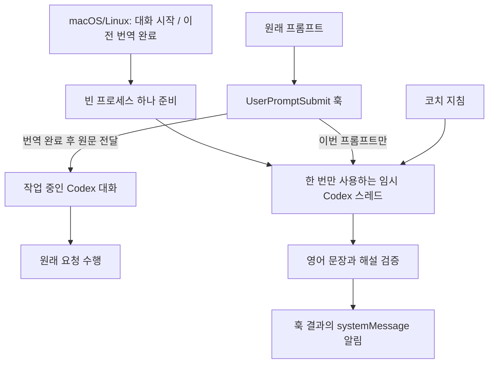

# Dev Lingo

[English](README.md) | 한국어

Codex에 평소처럼 입력하는 프롬프트로 자연스러운 엔지니어링 영어를 배워보세요.

Dev Lingo는 프롬프트를 일상적인 영어 구어체로 다듬고, 입력 언어로 짧은 문장별 해설을 제공합니다. 원래 의도와 기술적 조건을 유지하므로 영어를 쓰는 동료에게 같은 요청을 어떻게 전달할지 익힐 수 있습니다.

Codex는 원래 프롬프트로 작업을 계속합니다. 번역은 별도로 실행하며, 영어 문장과 코치 지침은 작업 중인 대화 모델의 컨텍스트에 추가하지 않습니다.

## 예시

평소처럼 프롬프트를 입력합니다.

```text
고마워! 이 코드는 기존 동작은 유지하면서 단순하게 바꿔줘. 좋은 하루 보내!
```

Dev Lingo가 번역 알림을 표시합니다.

```text
통역: Thanks!
통역: Could you simplify this code without changing its behavior?
해설: 'without changing its behavior'는 코드의 기존 동작을 유지한다는 뜻이에요.
통역: Have a great day!
```

해설은 최종 영어 문장마다 연결됩니다. 배울 만한 표현·뉘앙스·교정이 없는 문장은 해설을 생략할 수 있습니다. 실제 문구는 실행마다 달라집니다.

## 요구사항

- macOS, Linux 또는 Windows 10/11의 로컬 Codex 환경
- 설치 및 로그인된 Codex CLI — 검증 버전: `0.160.1`
- Python `3.9` 이상 — 추가 Python 패키지 불필요. Windows에서는 PowerShell과 앱 환경에서 실제 `python` 인터프리터를 실행할 수 있어야 합니다. Microsoft Store 실행 별칭만으로는 충분하지 않습니다.
- GitHub 설치 시 터미널에서 실행 가능한 Git

설치 전에 환경을 확인합니다.

```sh
codex --version
codex login status
```

Python은 macOS/Linux에서 `python3 --version`, Windows PowerShell에서 `python --version`으로 확인합니다. 인증이 필요하면 `codex login`을 실행합니다.

## 설치

**macOS, Linux, Windows 네이티브 환경을 지원합니다.** Windows는 프롬프트마다 독립 번역 프로세스를 실행합니다. 사전 준비는 macOS/Linux에서 제공합니다.

### Codex 플러그인으로 설치 (권장)

컴퓨터의 **터미널**에서 실행합니다. Windows는 PowerShell, macOS/Linux는 터미널을 사용하며, 세 운영체제의 설치 명령은 같습니다.

```sh
codex plugin marketplace add sngchlko/dev-lingo
codex plugin add dev-lingo@dev-lingo-local
```

Codex가 플러그인을 내려받아 설치합니다. 저장소를 직접 복제하거나 Python 설치 스크립트를 실행할 필요는 없습니다. Git, Python, 별도 Codex CLI는 미리 설치되어 있어야 합니다. Python은 설치된 훅을 실행할 때 필요합니다.

이 마켓플레이스를 이전에 등록했다면 [업데이트](#업데이트) 절차로 캐시를 갱신한 뒤 새 버전을 사용합니다.

다음으로 **Codex CLI**를 실행합니다.

```sh
codex
```

`/hooks`를 입력하고 Dev Lingo의 `SessionStart`, `UserPromptSubmit` 두 훅을 검토한 뒤 신뢰하도록 설정합니다. 플러그인을 설치하거나 활성화하는 것만으로 훅이 자동 신뢰되지는 않습니다. [공식 훅 신뢰 안내](https://learn.chatgpt.com/docs/hooks#review-and-trust-hooks)를 참고하세요.

CLI를 종료한 뒤 Codex 데스크톱 앱도 완전히 종료하고 다시 열어 새 로컬 대화에서 사용합니다. Windows에서는 PowerShell뿐 아니라 앱 환경에서도 실제 `python` 인터프리터를 실행할 수 있어야 합니다.

`dev-lingo-local`은 이 저장소에 정의된 마켓플레이스 식별자로, GitHub에서 설치해도 같습니다.

### 보조 방법: 설치 스크립트로 검증하고 설치

설치 스크립트는 같은 Codex 플러그인을 설치하며, 설치된 코드가 내려받은 소스와 일치하는지 확인한 뒤 훅 신뢰 설정을 자동으로 처리합니다. 이 검증을 원하거나 설치 문제를 확인할 때 사용할 수 있습니다.

```sh
git clone https://github.com/sngchlko/dev-lingo.git
cd dev-lingo
python3 scripts/install.py --marketplace sngchlko/dev-lingo --trust-hook
```

Windows PowerShell에서는 마지막 명령의 `python3`를 `python`으로 바꿉니다. 이미 내려받았다면 다시 복제하지 않고 해당 폴더에서 `git pull --ff-only`로 갱신합니다. `--trust-hook`을 사용하기 전에 [훅 정의](plugins/dev-lingo/hooks/hooks.json)와 [실행 코드](plugins/dev-lingo/scripts/)를 검토할 수 있습니다.

스크립트는 GitHub 마켓플레이스를 등록하거나 캐시를 갱신합니다. 성공하면 `installed: true`, `enabled: true`, `hook_trust: trusted`, `hook_count: 2`가 표시됩니다. 설치 후 앱을 완전히 종료하고 다시 엽니다.

Windows에서는 설치 스크립트와 번역기가 npm의 `codex.cmd` 대신 패키지에 포함된 네이티브 `codex.exe`를 찾아 실행합니다. 찾지 못한다면 앱에서 사용하는 환경의 `DEV_LINGO_CODEX`에 `codex.exe`의 절대 경로를 지정합니다.

### 로컬 소스에서 설치

개발용 소스나 ZIP을 사용한다면 프로젝트 루트에서 실행합니다.

```sh
python3 scripts/install.py --trust-hook
```

Windows에서는 `python`을 사용합니다. 이 명령은 해당 폴더를 로컬 마켓플레이스로 등록합니다. `dev-lingo-local`이 이미 GitHub로 등록되어 있다면 `--marketplace sngchlko/dev-lingo`를 추가해 같은 소스를 사용합니다. 등록 소스를 바꾸려면 먼저 `codex plugin marketplace remove dev-lingo-local`로 기존 등록을 제거하고 다시 설치합니다. 이 명령은 등록만 제거하며 설치된 플러그인은 삭제하지 않습니다.

## 사용법

로컬 Codex 대화에 프롬프트를 입력합니다. `UserPromptSubmit` 훅이 영어 문장과 해설을 표시한 뒤 Codex가 원래 요청을 처리합니다. 별도 명령이나 학습 모드 전환은 필요하지 않습니다.

macOS/Linux에서는 대화가 시작되면 `SessionStart` 훅이 빈 번역 프로세스 하나를 백그라운드에서 준비합니다. 프롬프트를 제출할 때 준비가 완료되어 있으면 해당 프로세스를 한 번 사용하고 종료한 뒤, 다음 빈 프로세스를 준비합니다. 준비 단계에서는 사용자 프롬프트를 보내거나 모델 응답을 생성하지 않습니다. 준비된 프로세스가 없거나 사용 중이면 새 독립 실행으로 번역합니다.

- **영어 출력:** 다른 언어의 프롬프트는 영어로 옮기고, 영어 프롬프트는 표현과 문법을 다듬습니다.
- **입력 언어로 해설:** 코드와 기술 식별자를 제외한 본문의 주된 언어를 감지합니다. 언어가 섞이거나 입력이 매우 짧으면 감지가 부정확할 수 있습니다.
- **문장별 코칭:** 해설은 최종 영어 문장을 기준으로 연결합니다. 원문의 문장을 합치거나 나눌 수 있습니다.
- **번역 알림:** 결과는 대화 화면의 훅 결과에 표시됩니다. 접혀 있으면 해당 훅 항목을 펼칩니다.

영어 문장 앞의 `통역:` 표시는 현재 모든 입력 언어에서 동일합니다. 해설 표시 이름은 감지한 언어에 따라 `해설:`, `Explanation:`, `解説:`, `Explicación:` 등으로 바뀝니다.

소스를 내려받았다면 해당 폴더에서 번역을 직접 확인할 수도 있습니다.

```sh
python3 plugins/dev-lingo/scripts/dev_lingo.py translate \
  'I think this way have problem. Can you check it one more time?' \
  --host codex
```

명령은 영어 문장과 해설을 담은 JSON을 반환합니다.

## 설정

| 환경 변수 | 용도 |
| --- | --- |
| `DEV_LINGO_CODEX` | Codex CLI 실행 파일 경로. 지정하지 않으면 PATH와 지원되는 설치 경로에서 탐색합니다. |
| `DEV_LINGO_MODEL` | 별도 번역 실행에 사용할 모델 |
| `DEV_LINGO_COACH_FILE` | 사용자 지정 코치 지침 파일의 절대 경로 |
| `DEV_LINGO_PREWARM` | macOS/Linux에서 `0`으로 설정하면 사전 준비를 끕니다. Windows에서는 이 설정과 관계없이 항상 독립 실행합니다. |

환경 변수는 앱과 훅 프로세스에도 전달되어야 합니다. 이미 실행 중인 앱은 터미널에서 나중에 설정한 값을 받지 못할 수 있습니다.

번역 모델은 작업 중인 대화에서 선택한 모델과 독립적입니다. 두 실행 경로 모두 기본적으로 `gpt-6.1-sol / low`를 사용하며, `DEV_LINGO_MODEL`로 모델을 변경할 수 있습니다. 준비된 번역은 표준 서비스 티어를 사용합니다.

[coach.txt](plugins/dev-lingo/prompts/coach.txt)는 구어체 스타일과 해설 언어 규칙을, [output.schema.json](plugins/dev-lingo/prompts/output.schema.json)은 결과 형식을 정의합니다. 기본 지침을 수정한 뒤에는 설치 스크립트를 다시 실행해 설치본을 갱신합니다.

## 플러그인 관리

### 비활성화와 재활성화

`codex`를 실행하고 `/plugins`를 연 뒤, `dev-lingo-local`에 설치된 Dev Lingo를 선택하고 `Space`로 활성화 상태를 전환합니다.

사용자 설정 파일(기본 `~/.codex/config.toml`, Windows는 `$env:USERPROFILE\.codex\config.toml`)의 해당 항목을 수정할 수도 있습니다.

```toml
[plugins."dev-lingo@dev-lingo-local"]
enabled = false
```

다시 켜려면 `enabled = true`로 변경합니다. 특정 신뢰된 프로젝트에서만 끄려면 해당 프로젝트의 `.codex/config.toml`에 같은 설정을 둡니다. 프로젝트 설정은 사용자 설정보다 우선합니다. 설정 변경 후 앱을 다시 엽니다.

macOS/Linux에서 사용하지 않은 준비 프로세스는 번역 없이 2분이 지나면 종료됩니다. 대기 중인 준비 워커를 즉시 중지하려면 설치된 스크립트의 `stop` 명령을 실행합니다.

```sh
python3 ~/.codex/plugins/cache/dev-lingo-local/dev-lingo/0.1.4/scripts/dev_lingo.py stop
```

플러그인을 비활성화하거나 제거하면 새로운 훅 호출이 중단됩니다. 이미 실행 중인 번역은 완료되거나 취소될 때까지 계속될 수 있습니다. 사용하지 않은 준비 워커는 유휴 시간 제한에 따라 종료됩니다.

### 업데이트

GitHub 마켓플레이스의 캐시를 갱신하고 플러그인을 다시 설치합니다. Windows PowerShell에서도 같은 명령을 사용합니다.

```sh
codex plugin marketplace upgrade dev-lingo-local
codex plugin add dev-lingo@dev-lingo-local
```

`codex`를 실행하고 `/hooks`에서 변경된 Dev Lingo 훅을 검토해 신뢰하도록 설정합니다. 데스크톱 앱을 완전히 종료하고 다시 엽니다. 별도로 소스를 내려받을 필요는 없습니다.

로컬 설치는 소스를 갱신한 뒤 다시 실행합니다.

```sh
python3 scripts/install.py --trust-hook
```

훅 정의가 변경되면 신뢰 검토가 다시 필요할 수 있습니다. 업데이트 후 앱을 다시 엽니다.

### 삭제

플러그인과 설치 캐시를 제거합니다.

```sh
codex plugin remove dev-lingo@dev-lingo-local
```

마켓플레이스 등록도 제거하려면 실행합니다.

```sh
codex plugin marketplace remove dev-lingo-local
```

앱을 다시 열면 제거 상태가 반영됩니다. 별도로 내려받은 소스 파일과 ZIP 파일은 디스크에 남습니다.

## 동작 방식



번역 훅은 동기 실행합니다. Dev Lingo는 번역 완료를 확인한 뒤 UI 전용 `systemMessage`를 반환하며, Codex는 `hook/completed` 결과에 알림을 표시하고 원래 요청을 처리합니다. 따라서 작업 시작 전에 번역 대기 시간이 생깁니다.

데스크톱 앱은 일반 `warning` 알림을 수신 대상에서 제외할 수 있습니다. 비동기 훅은 `hook/completed` 결과도 보내지 않으므로, 번역이 성공해도 대화 화면에 표시되지 않을 수 있습니다. Dev Lingo는 데스크톱 앱을 위해 동기 훅 전달 방식을 사용합니다. 작업과 번역을 병렬 실행하면서 대화 화면에 결과를 표시하는 방식은 현재 지원하지 않습니다. [공식 알림 제외 설정 안내](https://learn.chatgpt.com/docs/app-server#notification-opt-out)를 참고하세요.

macOS/Linux에서는 입력이 도착하기 전에 빈 스레드를 준비합니다. 로컬 워커는 아직 사용하지 않은 Codex 프로세스 하나를 유지하고, 사용자 전용 임시 디렉터리의 Unix 소켓으로 요청을 받습니다. 각 프로세스는 번역을 최대 한 번 처리한 뒤 종료됩니다. 워커는 번역 없이 2분이 지나면 종료됩니다. 첫 요청이나 준비할 시간이 부족한 요청에서는 지연 감소 효과가 작을 수 있습니다.

준비 워커는 대기 중에도 메모리를 사용합니다. 반복된 준비 요청은 잠금 상태를 확인해 중복 프로세스 실행을 피합니다. 실행한 워커는 백그라운드에서 종료를 기다려 회수하고, 번역 종료 시에는 Codex 프로세스의 종료를 확인한 뒤 같은 프로세스 그룹에 남은 자식도 정리합니다.

Windows에서는 독립 `codex exec` 경로를 사용합니다. 읽기·쓰기 스레드가 하나의 전체 시간 제한 안에서 UTF-8 파이프를 처리합니다. 전용 Windows Job Object가 프로세스 트리를 소유하며, 번역이 종료되거나 훅 프로세스가 종료되면 남은 자식 프로세스를 정리합니다. Windows의 `SessionStart`는 Python을 실행하지 않고 즉시 종료합니다. 번역 훅은 `commandWindows`와 Python 실행 코드를 사용해 `PLUGIN_ROOT`를 직접 읽으므로 셸별 환경 변수 확장에 의존하지 않습니다.

### 컨텍스트 분리

각 번역은 새 임시 디렉터리에서 아직 사용하지 않은 프로세스로 실행합니다. Dev Lingo는 작업 중인 세션을 resume/fork하거나 대화 기록을 읽거나 프로젝트 파일을 수집하지 않습니다. 번역에 전달하는 사용자 데이터는 이번 프롬프트뿐입니다. 사용한 번역 프로세스는 종료합니다.

사전 준비 경로는 `codex app-server`를 사용하며, 이 명령에는 사용자 설정 전체를 무시하는 옵션이 없습니다. Dev Lingo는 코치 지침을 명시적으로 전달하고 개인 개발자 지침을 비우며, 프로젝트 문서 로딩을 끕니다. 해당 프로세스와 스레드에서 훅·플러그인·앱·메모리·서브에이전트·쉘 실행·스킬 검색·웹 검색·개인 MCP 서버·알림 명령도 비활성화합니다. 독립 실행으로 대체할 때 사용하는 `codex exec`는 사용자 설정과 실행 규칙도 무시합니다. 개인 설정 파일은 수정하지 않습니다. 부모 대화와 플러그인 관련 환경 변수를 걸러내고, 재호출 방지 장치로 번역 훅의 재귀 실행을 막습니다.

훅 출력은 UI 알림용 `systemMessage`만 사용합니다. `additionalContext`나 모델 입력으로 들어가는 일반 텍스트는 반환하지 않습니다. [컨텍스트 분리 통합 테스트](tests/check_context_isolation.py)는 실제 Codex CLI와 app-server 요청을 캡처해 이 경계를 검증합니다. 앱과 같은 `warning` 제외 설정에서 번역이 `hook/completed`로 전달되는지, 이번 요청과 후속 요청의 모델 입력에 번역·해설이 포함되지 않는지 확인합니다.

[준비된 번역 테스트](tests/check_prepared_isolation.py)는 준비 단계에서 모델 추론을 실행하지 않는지, 개인 지침과 연동 기능이 비활성 상태인지, 이전 번역의 입력이 다음 요청에 포함되지 않는지 확인합니다.

### 번역 기록

Dev Lingo는 학습 기록 파일이나 데이터베이스를 유지하지 않습니다. 준비된 스레드는 `ephemeral: true`를, 독립 실행은 `--ephemeral`을 사용합니다. 결과는 메모리에서 처리하고 실행 후 임시 작업 디렉터리를 삭제합니다. 이전 번역은 다음 실행의 컨텍스트로 재사용하지 않습니다. 준비 워커의 임시 디렉터리에는 소켓과 빈 잠금 파일만 있으며 프롬프트나 결과는 저장하지 않습니다.

이 설명은 Dev Lingo 자체의 번역 저장에 한정됩니다. 원래 Codex 대화, Codex 알림과 진단, 사용량 기록, 모델 제공자의 데이터 보관 정책은 변경하지 않습니다.

## 제한 사항과 문제 해결

- 현재 macOS/Linux/Windows의 로컬 Codex를 지원합니다. 클라우드 대화와 다른 코딩 에이전트는 지원 범위에 포함하지 않습니다.
- 번역마다 Codex 사용량을 소비하며 원래 작업의 시작이 지연됩니다.
- 독립 번역의 제한 시간은 45초, 준비된 번역은 40초, 훅은 55초입니다. 오류·인증 실패·사용량 제한·시간 초과 시 알림을 생략하고 원래 작업을 진행합니다. 준비된 실행이 프롬프트를 받았을 가능성이 있으면 다른 모델 호출로 자동 재시도하지 않습니다.
- 빈 프롬프트, 16,000자를 넘는 프롬프트, 64 KiB를 넘는 훅 입력은 생략합니다.

| 증상 | 확인 사항 |
| --- | --- |
| `already added from a different source` | GitHub로 등록했다면 `--marketplace sngchlko/dev-lingo`를 지정합니다. 소스를 바꾸려면 기존 마켓플레이스 등록을 먼저 제거합니다. |
| Windows / PowerShell 설치 또는 훅 실행 실패 | `python` 실행 여부와 훅 신뢰 갱신을 확인합니다. 보조 설치 스크립트로 설치본을 검증할 수 있습니다. CLI의 OS 오류는 전체 메시지와 번호로 확인합니다. |
| Codex 실행 파일을 찾지 못함 | CLI 설치, PATH, `DEV_LINGO_CODEX` |
| 설치 후 알림이 표시되지 않음 | CLI 인증, 플러그인 활성화, 훅 신뢰 상태, 앱 재시작 |
| 결과가 보이지 않음 | `통역:`으로 시작하는 알림과 로컬 대화 여부를 확인합니다. 갱신 후 훅 신뢰 설정을 다시 적용하고 앱을 다시 엽니다. |
| 일부 프롬프트에서만 생략됨 | 입력 크기, 사용량 제한, 직접 번역 명령의 오류 |
| Windows `SessionStart`에서 5초 타임아웃 | 0.1.2 이상으로 갱신하고 `/hooks`에서 변경된 훅을 신뢰한 뒤 앱을 완전히 종료하고 다시 엽니다. Windows 시작 훅은 Python을 실행하지 않고 즉시 종료합니다. |
| 0.1.3 설치 후 번역이 표시되지 않음 | 0.1.4 이상으로 갱신하고 `/hooks`에서 변경된 훅을 신뢰한 뒤 앱을 완전히 종료하고 다시 엽니다. 0.1.3의 비동기 알림은 앱의 수신 대상에서 제외될 수 있습니다. |
| 작업 시작 전에 잠시 대기함 | 번역 완료 후 Codex가 원래 작업을 시작합니다. 번역 모델의 처리와 실행 준비 시간이 포함됩니다. |

설치와 인증 상태를 확인합니다.

```sh
codex plugin list --marketplace dev-lingo-local --json
codex login status
```

## 개발

소스 폴더에서 단위 테스트와 네이티브 훅 통합 검사를 실행합니다.

```sh
python3 -m unittest discover -s tests -v
python3 tests/check_context_isolation.py
```

Windows에서는 `python`을 사용합니다. 통합 검사에는 설치 및 신뢰 설정이 완료된 Dev Lingo가 필요합니다. 요청을 거부하는 로컬 제공자를 사용하며, 외부 모델은 호출하지 않습니다. 앱과 같은 알림 제외 설정에서 훅 결과가 전달되는지, 이번 요청과 후속 요청의 모델 입력에 번역이 포함되지 않는지 확인합니다. 같은 설정에서 비동기 알림이 누락되는 상황도 회귀 검사로 재현합니다.

macOS/Linux에서는 준비된 스레드의 격리와 워커 수명 주기도 검사할 수 있습니다.

```sh
python3 tests/check_prepared_isolation.py
python3 tests/check_lifecycle.py
```

수명 주기 검사는 로컬 테스트용 실행 파일로 실패·취소·강제 종료를 포함한 100회 요청을 수행합니다. 개발용 보고서는 `reports/`에 저장하며, 일반적인 플러그인 사용에서는 이 보고서를 만들지 않습니다.

[GitHub Actions](.github/workflows/compatibility.yml)에서 Windows(Python 3.9/3.12), macOS, Linux를 검사합니다. 외부 모델 호출 없이 설치, 이전 마켓플레이스 캐시에서의 업데이트, 훅 신뢰 설정, 앱에서 사용하는 훅 결과 전달, 컨텍스트 분리, 프로세스 정리를 확인합니다.

선택적으로 실행하는 `tests/evaluate_languages.py`, `tests/evaluate_latency.py`, `tests/evaluate_prewarm.py`는 실제 모델을 호출해 Codex 사용량을 소비하며, 입력과 결과를 `reports/`에 저장합니다. 사전 준비 평가는 macOS/Linux에서 실행합니다. 설정과 모의 타이핑 시간을 제외해 측정하므로 준비되지 않은 첫 요청의 지연 시간을 나타내지는 않습니다.

| 파일 | 역할 |
| --- | --- |
| [dev_lingo.py](plugins/dev-lingo/scripts/dev_lingo.py) | CLI 진입점과 훅 실행 흐름 |
| [hosts.py](plugins/dev-lingo/scripts/hosts.py) | 호스트별 훅 입력과 알림 출력 |
| [codex_provider.py](plugins/dev-lingo/scripts/codex_provider.py) | 격리된 Codex 실행, 시간 제한, 결과 수집 |
| [codex_prepared.py](plugins/dev-lingo/scripts/codex_prepared.py) | 빈 임시 스레드 준비와 일회성 번역 |
| [prewarm.py](plugins/dev-lingo/scripts/prewarm.py) | 전용 로컬 워커, 동시 요청의 대체 실행, 유휴 상태 종료 |
| [lingo_process.py](plugins/dev-lingo/scripts/lingo_process.py) | 실행 파일 탐색, Windows 훅 명령, 프로세스 트리 정리 |
| [lingo_core.py](plugins/dev-lingo/scripts/lingo_core.py) | 결과 검증, 문장 표시, 환경 변수 필터링 |
| [.agents/plugins/marketplace.json](.agents/plugins/marketplace.json) | 마켓플레이스 카탈로그 |
| [.codex-plugin/plugin.json](plugins/dev-lingo/.codex-plugin/plugin.json) | 플러그인 메타데이터 |
