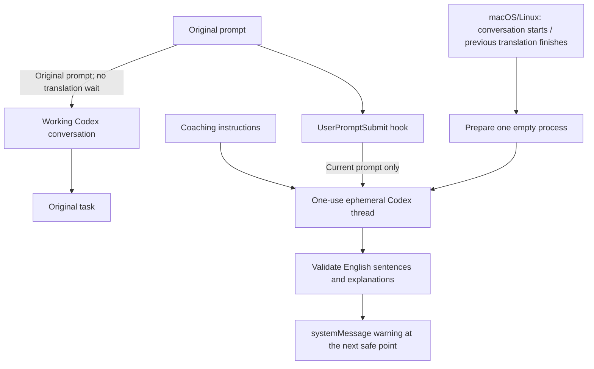

# Dev Lingo

English | [한국어](README.ko.md)

Learn natural engineering English from the prompts you already write in Codex.

Dev Lingo rewrites your prompts as everyday spoken English and adds short, sentence-by-sentence explanations in your input language. It preserves your intent and technical details, so you can learn how to make the same request to an English-speaking coworker.

Codex continues working with your original prompt. Translation runs separately, and the English rewrite and coaching instructions stay out of your working conversation's model context.

## Example

Write a prompt as usual:

```text
고마워! 이 코드는 기존 동작은 유지하면서 단순하게 바꿔줘. 좋은 하루 보내!
```

Dev Lingo displays a translation notification:

```text
통역: Thanks!
통역: Could you simplify this code without changing its behavior?
해설: 'without changing its behavior'는 코드의 기존 동작을 유지한다는 뜻이에요.
통역: Have a great day!
```

Each explanation belongs to a final English sentence. Sentences without a useful expression, nuance, or correction can skip the explanation. Exact wording varies between runs.

## Requirements

- A local Codex environment on macOS, Linux, or Windows 10/11.
- Codex CLI installed and signed in. Tested with version `0.160.1`.
- Python `3.9` or later. No additional Python packages required. On Windows, `python` must work in PowerShell and in the app’s environment; a Microsoft Store alias alone is insufficient.
- Git available in the terminal for GitHub installation.

Check your environment before installing:

```sh
codex --version
codex login status
```

Check Python with `python3 --version` on macOS/Linux or `python --version` in Windows PowerShell. If authentication is needed, run `codex login`.

## Installation

**Supported platforms: macOS, Linux, and native Windows.** Windows uses an independent translation process for every prompt; preparation is available on macOS and Linux.

### Install as a Codex plugin (recommended)

Run these commands in your computer's **terminal**—PowerShell on Windows, or a terminal on macOS/Linux. The commands are the same on all three platforms:

```sh
codex plugin marketplace add sngchlko/dev-lingo
codex plugin add dev-lingo@dev-lingo-local
```

Codex downloads and installs the plugin. You do not need to clone the repository or run the Python installer. Git, Python, and the standalone Codex CLI must already be available; the plugin needs Python to run its hooks.

If this marketplace was added before, follow [Update](#update) to refresh its cached source before using the new version.

Next, launch the **Codex CLI**:

```sh
codex
```

Enter `/hooks`, review Dev Lingo's `SessionStart` and `UserPromptSubmit` hooks, and trust both. Installing or enabling the plugin alone does not trust its hooks. See the official [hook trust instructions](https://learn.chatgpt.com/docs/hooks#review-and-trust-hooks).

Exit the CLI, completely quit and reopen the Codex desktop app, and start a new local chat. On Windows, confirm that the real `python` interpreter is available to the app as well as PowerShell.

`dev-lingo-local` is the marketplace identifier defined in this repository, including when installed from GitHub.

### Optional: install and verify with the helper script

The helper installs the same Codex plugin and automates hook trust after verifying that the installed code matches the downloaded source. Use it if you prefer that verification or need to troubleshoot installation:

```sh
git clone https://github.com/sngchlko/dev-lingo.git
cd dev-lingo
python3 scripts/install.py --marketplace sngchlko/dev-lingo --trust-hook
```

On Windows PowerShell, use `python` instead of `python3` in the last command. If you already have the checkout, run `git pull --ff-only` instead of cloning again. You can review the [hook definition](plugins/dev-lingo/hooks/hooks.json) and [execution code](plugins/dev-lingo/scripts/) before using `--trust-hook`.

The helper registers or refreshes the GitHub marketplace and reports `installed: true`, `enabled: true`, `hook_trust: trusted`, and `hook_count: 2` on success. Completely quit and reopen the app afterward.

On Windows, the helper and translator resolve an npm `codex.cmd` shim to its packaged native `codex.exe`. If discovery fails, set `DEV_LINGO_CODEX` to the absolute `codex.exe` path in the environment used by the app.

### From local source

For development or a downloaded ZIP, run from the project root:

```sh
python3 scripts/install.py --trust-hook
```

Use `python` on Windows. This registers the checkout as a local marketplace. If `dev-lingo-local` is already registered from GitHub, add `--marketplace sngchlko/dev-lingo` to keep using that source. To deliberately switch sources, remove the old registration with `codex plugin marketplace remove dev-lingo-local`, then rerun the installer. This removes the registration, not the installed plugin.

## Usage

Submit a prompt in a local Codex conversation. The `UserPromptSubmit` hook translates in the background while Codex handles your original request. The rewrite and explanations appear as a notification when Codex can deliver the result. No extra command or learning mode is needed.

On macOS/Linux, when a conversation starts, the `SessionStart` hook prepares one empty translation process in the background. If it is ready when you submit a prompt, Dev Lingo uses it once and closes it, then prepares another empty process. Preparation sends no user prompt and generates no model response. If preparation is unavailable or busy, translation uses a fresh independent run.

- **English output:** prompts in other languages are rewritten in English; English prompts are polished for wording and grammar.
- **Explanations in your language:** the coach detects the main language of your prose, ignoring code and technical identifiers. Mixed or very short inputs may be detected incorrectly.
- **Sentence-by-sentence coaching:** explanations follow the final English sentences, which may combine or split your original sentences.
- **Background notifications:** output appears as a notification in the conversation. It is delivered at a safe point after the current model request and tool calls finish; if the task has already ended, delivery may wait until your next message.

The English line prefix is currently `통역:` for every input language. Explanation labels follow the detected language, such as `해설:`, `Explanation:`, `解説:`, or `Explicación:`.

From a downloaded source checkout, you can also test a rewrite directly:

```sh
python3 plugins/dev-lingo/scripts/dev_lingo.py translate \
  'I think this way have problem. Can you check it one more time?' \
  --host codex
```

The command returns JSON containing the English sentences and their explanations.

## Configuration

| Environment variable | Purpose |
| --- | --- |
| `DEV_LINGO_CODEX` | Path to the Codex CLI executable. Otherwise, Dev Lingo searches PATH and supported installation locations. |
| `DEV_LINGO_MODEL` | Model to use for the separate translation run. |
| `DEV_LINGO_COACH_FILE` | Absolute path to a custom coaching instruction file. |
| `DEV_LINGO_PREWARM` | On macOS/Linux, set to `0` to disable preparation. Windows always uses an independent run, regardless of this variable. |

These variables must reach the app and its hook process. An app that is already running may not receive variables set later in a terminal.

The translation model is independent of the model selected in your working conversation. Both execution paths default to `gpt-6.1-sol / low`; `DEV_LINGO_MODEL` can override the model. Prepared translation uses the standard service tier.

[coach.txt](plugins/dev-lingo/prompts/coach.txt) defines the conversational style and explanation language rules. [output.schema.json](plugins/dev-lingo/prompts/output.schema.json) defines the result format. After changing the bundled instructions, rerun the installer to update the installed copy.

## Managing the plugin

### Disable or re-enable

Run `codex`, open `/plugins`, select the installed Dev Lingo plugin under `dev-lingo-local`, and press `Space` to toggle it.

You can also change its entry in your user configuration, normally `~/.codex/config.toml` (Windows: `$env:USERPROFILE\.codex\config.toml`):

```toml
[plugins."dev-lingo@dev-lingo-local"]
enabled = false
```

Set `enabled = true` to re-enable it. To disable it for a specific trusted project, use the same entry in that project's `.codex/config.toml`. Project configuration takes precedence over user configuration. Reopen the app after changing the setting.

On macOS/Linux, unused preparation processes stop after two minutes without a translation. To stop an idle preparation worker immediately, run the installed script with `stop`:

```sh
python3 ~/.codex/plugins/cache/dev-lingo-local/dev-lingo/0.1.3/scripts/dev_lingo.py stop
```

Disabling or removing the plugin prevents new hook invocations. Background translations can continue while the session remains open; Codex cancels them when the session ends. Unused preparation workers expire on the idle limit.

### Update

For a GitHub marketplace installation, refresh the source and reinstall the plugin. These commands also work in Windows PowerShell:

```sh
codex plugin marketplace upgrade dev-lingo-local
codex plugin add dev-lingo@dev-lingo-local
```

Open `codex`, enter `/hooks`, and review and trust any changed Dev Lingo hooks. Completely quit and reopen the desktop app. No source checkout is required.

For a local installation, update the source and rerun:

```sh
python3 scripts/install.py --trust-hook
```

Changes to the hook definition may require another trust review. Reopen the app after updating.

### Uninstall

Remove the plugin and its installation cache:

```sh
codex plugin remove dev-lingo@dev-lingo-local
```

Optionally remove the marketplace registration:

```sh
codex plugin marketplace remove dev-lingo-local
```

Reopen the app to apply the change. Separately downloaded source files and ZIP archives remain on disk.

## How it works



The translation hook uses `async: true`, so Codex starts the original task without waiting for translation. Dev Lingo returns its UI-only `systemMessage` after translation completion is confirmed. Codex delivers it at the next safe point after the current model request and tool calls finish. If no turn is active, it waits until the next user turn. Finishing translation does not start a new turn. See [background hook delivery](https://learn.chatgpt.com/docs/hooks#how-background-hooks-run).

On macOS/Linux, preparation creates an empty thread before input arrives. A local worker holds one unused Codex process and accepts requests through a Unix socket in a user-private temporary directory. Each process handles at most one translation and is then terminated. The worker expires after two minutes without a translation. First requests and requests without enough preparation time may see little benefit.

The preparation worker occupies memory while it is idle. Repeated preparation requests check the worker lock before launching another process. A background waiter reaps every launched worker, and translation cleanup waits for the Codex process and terminates remaining members of its private process group.

On Windows, translation uses the independent `codex exec` path. Reader and writer threads handle UTF-8 pipes under one absolute deadline. A private Windows Job Object owns the process tree and kills remaining child processes when closed or when the hook process exits. Windows `SessionStart` exits immediately without starting Python. The translation hook uses `commandWindows` with a Python bootstrap that reads `PLUGIN_ROOT` directly, avoiding shell-specific environment-variable expansion.

### Context isolation

Each translation uses an unused process in a new temporary directory. Dev Lingo does not resume or fork the working session, read its conversation history, or collect project files. The current prompt is the only user content passed to translation. Used translation processes are terminated.

The prepared path uses `codex app-server`, which has no option to ignore the entire user configuration. Dev Lingo explicitly supplies its coaching instructions, clears personal developer instructions, disables project document loading, and turns off hooks, plugins, apps, memories, subagents, shell execution, skill search, web search, personal MCP servers, and notification commands for that process and thread. The independent `codex exec` fallback also ignores user configuration and execution rules. Personal configuration files are not modified. Parent conversation and plugin environment variables are filtered, and a guard prevents recursive translation hooks.

Hook output uses only `systemMessage` for the UI notification. It does not return `additionalContext` or plain text that would become model input. The [context isolation integration test](tests/check_context_isolation.py) captures real Codex CLI and app-server requests to verify this boundary. A delayed translation fixture verifies that the working model request starts before translation finishes, that a warning reaches a safe delivery point, and that current and follow-up model inputs contain no translated text or explanation.

The [prepared translation test](tests/check_prepared_isolation.py) verifies that preparation performs no inference, personal instructions and integrations remain inactive, and one translation's input is absent from the next request.

### Translation history

Dev Lingo does not maintain a learning log or database. Prepared threads use `ephemeral: true`; independent runs use `--ephemeral`. Results are handled in memory, and temporary working directories are deleted after the run. Previous translations are not reused as context. The preparation worker's temporary directory contains a socket and an empty lock file, not prompts or results.

This applies to Dev Lingo's own translation storage. It does not change storage for the original Codex conversation, Codex notifications or diagnostics, usage records, or the model provider's data retention policies.

## Limits and troubleshooting

- Only local Codex on macOS, Linux, and Windows is currently supported. Cloud conversations and other coding agents are outside the current support scope.
- Each translation consumes Codex usage. Background execution removes the translation wait before the original task; it does not make the translation itself faster.
- Independent translation has a 45-second timeout; prepared translation has a 40-second timeout; the hook has a 55-second timeout. On errors, authentication failures, usage limits, or timeouts, the hook skips the notification and lets the original task proceed. Once a prepared run may have received the prompt, Dev Lingo does not retry automatically with another model call.
- Codex permits up to eight background hooks per session; additional hooks queue. Outputs can arrive in a different order from their inputs. Session end cancels unfinished hooks and discards undelivered output.
- Empty prompts, prompts longer than 16,000 characters, and hook payloads larger than 64 KiB are skipped.

| Symptom | What to check |
| --- | --- |
| `already added from a different source` | Use `--marketplace sngchlko/dev-lingo` for an existing GitHub registration, or explicitly remove the old marketplace registration before switching sources. |
| Windows / PowerShell installation or hook failure | Confirm `python` works and refresh hook trust. The optional helper can verify installation. Native CLI OS errors need their complete message and number. |
| Codex executable cannot be found | CLI installation, PATH, or `DEV_LINGO_CODEX`. |
| No notification after installation | CLI authentication, plugin activation, hook trust, and app restart. |
| Output seems hidden | Look for a notification starting with `통역:` and confirm you are in a local conversation. Background delivery may wait for the next message. |
| Only some prompts are skipped | Input size, usage limits, and errors from the direct translation command. |
| Windows `SessionStart` times out after 5 seconds | Update to 0.1.2 or later, trust the changed hooks with `/hooks`, then completely quit and reopen the app. The Windows start hook now exits without launching Python. |
| Translation appears late or on the next message | Background output waits for a safe delivery point. Update to 0.1.3 or later if the original task still waits for translation, then refresh hook trust and reopen the app. |

Check installation and authentication:

```sh
codex plugin list --marketplace dev-lingo-local --json
codex login status
```

## Development

From the source checkout, run unit tests and the native hook integration check:

```sh
python3 -m unittest discover -s tests -v
python3 tests/check_context_isolation.py
```

Use `python` on Windows. The integration check requires an installed, trusted Dev Lingo plugin. It uses a delayed translation fixture and a local provider that rejects model requests, with no external inference. It checks that the original request starts before translation finishes, the notification arrives, and translated text stays out of current and follow-up model inputs.

Additional macOS/Linux checks cover prepared-thread isolation and worker lifecycle:

```sh
python3 tests/check_prepared_isolation.py
python3 tests/check_lifecycle.py
```

The lifecycle check uses local fixtures for 100 requests, including failures, cancellation, and forced termination. Development reports are written under `reports/`; normal plugin use does not create these reports.

[GitHub Actions](.github/workflows/compatibility.yml) runs native Windows with Python 3.9 and 3.12, macOS, and Linux. It checks installation, upgrades from an older marketplace cache, hook trust, asynchronous delivery, context isolation, and process cleanup without external model calls.

Optional evaluations in `tests/evaluate_languages.py`, `tests/evaluate_latency.py`, and `tests/evaluate_prewarm.py` call the actual model, consume Codex usage, and save test inputs and results under `reports/`. Preparation evaluation requires macOS/Linux; its timings exclude setup and simulated typing time, so they do not represent a cold request.

| File | Responsibility |
| --- | --- |
| [dev_lingo.py](plugins/dev-lingo/scripts/dev_lingo.py) | CLI entry point and hook flow. |
| [hosts.py](plugins/dev-lingo/scripts/hosts.py) | Host-specific hook input and notification output. |
| [codex_provider.py](plugins/dev-lingo/scripts/codex_provider.py) | Isolated Codex execution, timeout, and result collection. |
| [codex_prepared.py](plugins/dev-lingo/scripts/codex_prepared.py) | Empty ephemeral thread preparation and one-use translation. |
| [prewarm.py](plugins/dev-lingo/scripts/prewarm.py) | Private local worker, concurrent-request fallback, and idle shutdown. |
| [lingo_process.py](plugins/dev-lingo/scripts/lingo_process.py) | Executable discovery, Windows hook commands, and process-tree cleanup. |
| [lingo_core.py](plugins/dev-lingo/scripts/lingo_core.py) | Result validation, sentence formatting, and environment filtering. |
| [.agents/plugins/marketplace.json](.agents/plugins/marketplace.json) | Marketplace catalog. |
| [.codex-plugin/plugin.json](plugins/dev-lingo/.codex-plugin/plugin.json) | Plugin metadata. |
